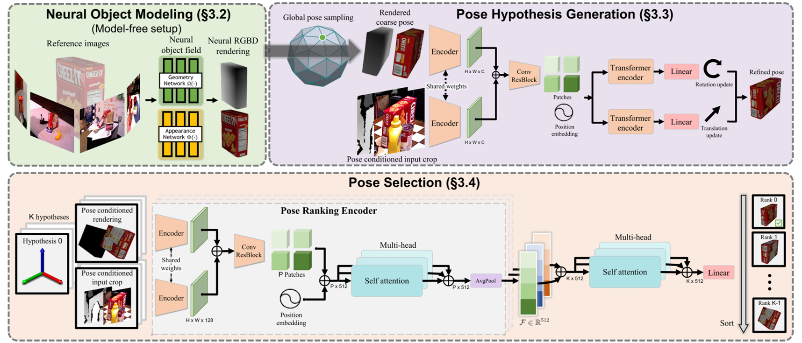
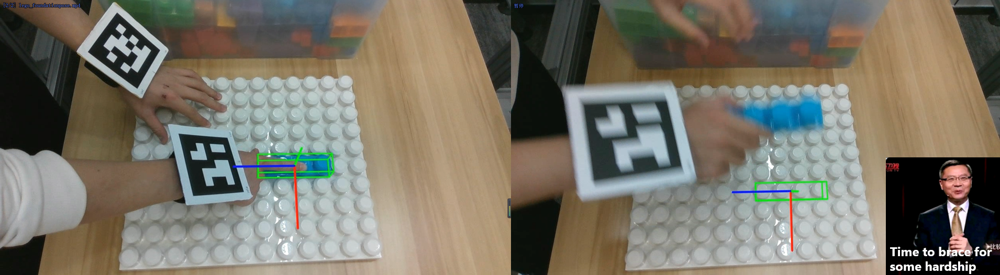
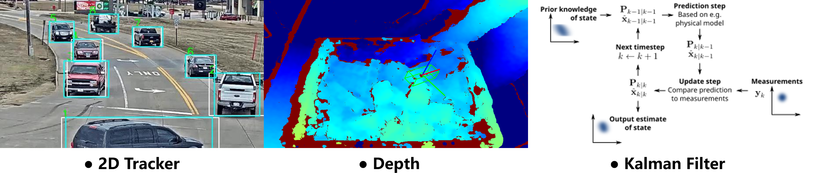
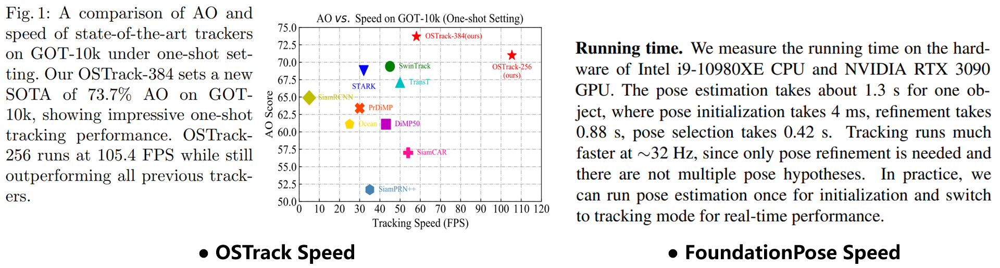

# FoundationPose++: Simple Tricks Boost FoundationPose Performance in High-Dynamic Scenes

FoundationPose++ is a real-time 6D pose tracker for highly dynamic scenes. 
This project is based on [FoundationPose](https://github.com/NVlabs/FoundationPose), and consists of four main modules: FoundationPose + 2D Tracker + Kalman Filter + Amodal Completion.

Here's the Introduction Video:

https://private-user-images.githubusercontent.com/105377443/421755163-34d1015c-8362-4f2d-a326-e45f9b873549.mp4?jwt=eyJhbGciOiJIUzI1NiIsInR5cCI6IkpXVCJ9.eyJpc3MiOiJnaXRodWIuY29tIiwiYXVkIjoicmF3LmdpdGh1YnVzZXJjb250ZW50LmNvbSIsImtleSI6ImtleTUiLCJleHAiOjE3NDE3NjYxMjEsIm5iZiI6MTc0MTc2NTgyMSwicGF0aCI6Ii8xMDUzNzc0NDMvNDIxNzU1MTYzLTM0ZDEwMTVjLTgzNjItNGYyZC1hMzI2LWU0NWY5Yjg3MzU0OS5tcDQ_WC1BbXotQWxnb3JpdGhtPUFXUzQtSE1BQy1TSEEyNTYmWC1BbXotQ3JlZGVudGlhbD1BS0lBVkNPRFlMU0E1M1BRSzRaQSUyRjIwMjUwMzEyJTJGdXMtZWFzdC0xJTJGczMlMkZhd3M0X3JlcXVlc3QmWC1BbXotRGF0ZT0yMDI1MDMxMlQwNzUwMjFaJlgtQW16LUV4cGlyZXM9MzAwJlgtQW16LVNpZ25hdHVyZT0wZDA4ODc2ZjMxMTI4NTkxNDQ2NTI3YTFlMDdiZjBkZjY5YTA1YWJkM2I2OGE4NjQ5Y2VhMTU1NjAzNDliNTBmJlgtQW16LVNpZ25lZEhlYWRlcnM9aG9zdCJ9.lx0LzU86OOOArH_otsZ_5n0GRr3mcxFPt09fCkq71VE

### For clearer video and to join the discussion community, please see [RedNote](https://www.xiaohongshu.com/discovery/item/67ce169b000000001201e203?source=webshare&xhsshare=pc_web&xsec_token=ABTzV32iwDLsRWKQcjSq_uNKS-7_ZXxHxrXb73L3UGnOI=&xsec_source=pc_share)

<br>

## Motivation

I am interning at a robotics company, and my first task is to develop an automatic annotation tool for a robot manipulation dataset. I need to solve for the 6D pose of target objects, and the first thing that came to mind was FoundationPose. However, FoundationPose performs poorly in tracking the 6D pose of objects in high-dynamic scenes. 

I believe the reason is that FoundationPose's tracking is a 'pseudo-tracking' method, where for each new frame, it uses the 6D pose solution from the previous frame as the initial solution for optimization. So, why not provide it with a real tracking method?




<br>

## Method
For the 6 degrees of freedom in 6D pose (x, y, z, roll, pitch, yaw), I use common 2D trackers like Cutie, Samurai, OSTrack, etc., for xy. For z, I directly take the depth at (x, y). For (roll, pitch, yaw), I use a Kalman Filter for tracking. This is a very simple and engineering-oriented trick, but the final results are outstanding. I named it FoundationPose++.



<br>

## Others
### Real-Time
The additional modules in FoundationPose++ do not significantly impact the real-time performance of the original FoundationPose. According to the original paper, FoundationPose is divided into two stages: Initialization and Tracking. Initialization only solves the first frame using a Refinement network and a Ranking network, which involves randomizing a few hundred initial solutions, running each through the Refinement, and then performing a final Ranking to select the highest-ranked solution as the solution for the first frame. For the subsequent tracking process, it doesn't need to initialize hundreds of solutions; it only needs to take the final solution from the previous frame as the initial solution for the next frame, which means only running the Refinement once without Ranking. This allows FoundationPose to achieve speeds of over 30 FPS on a 3090 (running in Python).

In our FoundationPose++, the tracking process also only requires running the Refinement once per frame. The additional time cost mainly comes from the 2D tracker. But you can choose a faster 2D tracker, like OSTrack, which can run at over 100 FPS on a 3090 and is very accurate.




### Amodal Completion
To improve occlusion resistance, we considered introducing Amodal Completion. This module might run slowly and have some compability issues, we are still working on the optimization of this module.

## News
- **`2025/03/12`** 🎉: We officially release our project containing tracker and kalman filter for public preview. Current code has been tested on both Nvidia RTX4090@Ubuntu20.04 and Nvidia H800@Ubuntu 22.04. If you have any problem using this project, feel free to submit an issue.

<br>

## Environment Setup
Check [install.md](./Install.md) to install all the dependencies.

<br>

## Prepare your testcase data
Your testcase data should be formatted like:
```
$PROJECT_ROOT/$TESTCASE
└── color
    ├── 0.png
    ├── 1.png
    └── ...
└── depth
    ├── 0.png
    ├── 1.png
    └── ...
└── mesh
    ├── mesh.obj/mesh.stl/etc.
```
There should be an RGB image file and a corresponding depth file for each frame, as well as a mesh file of the object, following [FoundationPose](https://github.com/NVlabs/FoundationPose) data format. You can check out [FoundationPose_manual](https://github.com/030422Lee/FoundationPose_manual) if you are not familiar with FoundationPose.

<br>

## Try our Demo
We provide our demo of lego_20fps in Google Drive: https://drive.google.com/file/d/1oN5IZHKlb06hEol6akwx1ibCiVcJBuuI/view?usp=sharing

The mask of the first frame has been included in the link. You can run the following scripts to check the results.
```
export TESTCASE="lego_20fps"
cd $PROJECT_ROOT
python src/obj_pose_track.py \
--rgb_seq_path $PROJECT_ROOT/$TESTCASE/color \
--depth_seq_path $PROJECT_ROOT/$TESTCASE/depth \
--mesh_path $PROJECT_ROOT/$TESTCASE/mesh/1x4.stl \
--init_mask_path $PROJECT_ROOT/$TESTCASE/0_mask.png \
--pose_output_path $PROJECT_ROOT/$TESTCASE/pose.npy \
--mask_visualization_path $PROJECT_ROOT/$TESTCASE/mask_visualization \
--bbox_visualization_path $PROJECT_ROOT/$TESTCASE/bbox_visualization \
--pose_visualization_path $PROJECT_ROOT/$TESTCASE/pose_visualization \
--cam_K "[[426.8704833984375, 0.0, 423.89471435546875], [0.0, 426.4277648925781, 243.5056915283203], [0.0, 0.0, 1.0]]" \
--activate_2d_tracker \
--apply_scale 0.01 \
--force_apply_color \
--apply_color "[0, 159, 237]" \
--est_refine_iter 10 \
--track_refine_iter 3
```

Then you will see the demo, which is the same as the one shown in the Introduction Video above ([RedNote](https://www.xiaohongshu.com/discovery/item/67ce169b000000001201e203?source=webshare&xhsshare=pc_web&xsec_token=ABTzV32iwDLsRWKQcjSq_uNKS-7_ZXxHxrXb73L3UGnOI=&xsec_source=pc_share)):

https://private-user-images.githubusercontent.com/105377443/422492166-b1c4afba-ad14-4222-9332-640070d98d94.mp4?jwt=eyJhbGciOiJIUzI1NiIsInR5cCI6IkpXVCJ9.eyJpc3MiOiJnaXRodWIuY29tIiwiYXVkIjoicmF3LmdpdGh1YnVzZXJjb250ZW50LmNvbSIsImtleSI6ImtleTUiLCJleHAiOjE3NDE4OTE0ODgsIm5iZiI6MTc0MTg5MTE4OCwicGF0aCI6Ii8xMDUzNzc0NDMvNDIyNDkyMTY2LWIxYzRhZmJhLWFkMTQtNDIyMi05MzMyLTY0MDA3MGQ5OGQ5NC5tcDQ_WC1BbXotQWxnb3JpdGhtPUFXUzQtSE1BQy1TSEEyNTYmWC1BbXotQ3JlZGVudGlhbD1BS0lBVkNPRFlMU0E1M1BRSzRaQSUyRjIwMjUwMzEzJTJGdXMtZWFzdC0xJTJGczMlMkZhd3M0X3JlcXVlc3QmWC1BbXotRGF0ZT0yMDI1MDMxM1QxODM5NDhaJlgtQW16LUV4cGlyZXM9MzAwJlgtQW16LVNpZ25hdHVyZT0zMjRiZjBjMzVhNmIwMDYzNGExNWMxZDllMzM1ZjA4NmM2ODc2YWJjNjgxMDFmYWMwMWE2ZjEyN2E4ZTAwZjJmJlgtQW16LVNpZ25lZEhlYWRlcnM9aG9zdCJ9.VCPTX4NycgCiqbpjlbI3oSPoj2VCBFfHCP-nZjDaNXw

The other video in the Introduction Video cannot be released as a demo because the meshes used in it are the private property of our company. ([PsiBot](https://www.qbitai.com/2024/11/218183.html)灵初智能)

<br>

## Inference with your own data
### Get the object mask of the first frame to initialize the 2D tracker
This process is to get the mask of the first frame, to help FoundationPose better locate the object during tracking. We use a 2-stage method (Qwen-VL + SAM-HQ) as an example to extract the mask, you can use any other tools to get the mask.


#### Use Qwen-VL to extract the bounding box [OPTIONAL]

We use Qwen-VL to extract the bounding box, you can use any other tools to get it or directly provide bounding box area without running QwenVL using commands like `BOUNDING_BOX_POSITION=[640, 419, 190, 37]`. 

```
# start Qwen-VL webapi
cd $PROJECT_ROOT
python src/WebAPI/qwen2_vl_api.py --weight_path $PROJECT_ROOT/Qwen2-VL/weights &

# use Qwen-VL to get the bbox of the object
cd $PROJECT_ROOT
BOUNDING_BOX_POSITION=$(python src/utils/obj_bbox.py \
    --frame_path $PROJECT_ROOT/$TESTCASE/color/0.png \
    --visualize_path $PROJECT_ROOT/$TESTCASE/0_bbox.png \
    --object_name $DESCRIPTION_OF_THE_OBJECT \
    --reference_img_path $PATH_OF_REFERENCE_IMAGE)
```

#### Use SAM-HQ to extract the mask [OPTIONAL]
We use SAM-HQ to extract the mask, you can use any other tools to get it or directly provide it in the path of `$PROJECT_ROOT/$TESTCASE/0_mask.png`. 
```
# start SAM webapi
python src/WebAPI/hq_sam_api.py --checkpoint_path $PROJECT_ROOT/sam-hq/pretrained_checkpoints/sam_hq_vit_h.pth &

# get the mask of object in the first frame
python src/utils/obj_mask.py  \
    --frame_path $PROJECT_ROOT/$TESTCASE/color/0.png \
    --bbox_xywh "$BOUNDING_BOX_POSITION" \
    --output_mask_path $PROJECT_ROOT/$TESTCASE/0_mask.png
```

`$DESCRIPTION_OF_THE_OBJECT`: the description of an object to help QwenVL anchor box positions, better in Chinese.

`$PATH_OF_REFERENCE_IMAGE`: you can provide what the object looks like to help QwenVL anchor box positions more precisely.

### 6D Pose Track Inference
Run the following script to track 6D Pose, the results will be visualized in `$PROJECT_ROOT/pose_visualization`.
```
cd $PROJECT_ROOT
python src/obj_pose_track.py \
--rgb_seq_path $PROJECT_ROOT/$TESTCASE/color \
--depth_seq_path $PROJECT_ROOT/$TESTCASE/depth \
--mesh_path $PROJECT_ROOT/$TESTCASE/mesh/1x4.stl \
--init_mask_path $PROJECT_ROOT/$TESTCASE/0_mask.png \
--pose_output_path $PROJECT_ROOT/$TESTCASE/pose.npy \
--mask_visualization_path $PROJECT_ROOT/$TESTCASE/mask_visualization \
--bbox_visualization_path $PROJECT_ROOT/$TESTCASE/bbox_visualization \
--pose_visualization_path $PROJECT_ROOT/$TESTCASE/pose_visualization \
--activate_2d_tracker \
--activate_kalman_filter \
--kf_measurement_noise_scale 0.05 \
--apply_scale 0.01
```

Use `-h` to see the usages of the parameters.

For finer grained kalman filter settings, see [kalman_filter_6d.py](./src/utils/kalman_filter_6d.py).

Use `force_apply_color` and `apply_color` to select a color for the mesh. Regarding other original [FoundationPose](https://github.com/030422Lee/FoundationPose_manual) parameters, checkout https://github.com/NVlabs/FoundationPose/issues/44#issuecomment-2048141043 if you have further problems or get unexpected results. 


## Citation
Currently we don't have a paper, so you don't need to formally cite us. Still, you can use the default 'Cite this repository' of github to get a BibTex version of citation.
